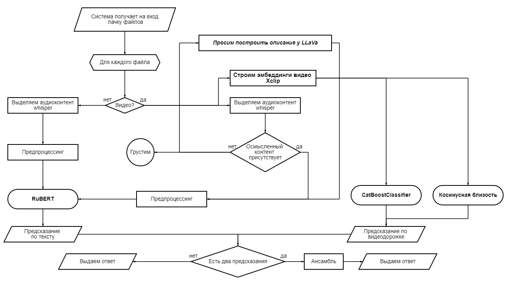

**API**: http://90.156.216.132:8000/docs#/
- /predict/: принимает видео или аудио на вход - возвращает класс
- /predict_table/: принимает xlsx таблицу с advertisment id - возвращает аналогичную таблицу с предсказанными классами для каждого id

**Сделано**: 

- классификация рекламы по аудио-составляющей, пайплайн: rus --> audio2text (whisper-small) --> rubert-tiny --> label (~1s)
- классификация рекламы по видео-составляющей, пайплайн: rus --> x-clip features extraction --> cosine similarity/catboost --> label (~2s)

**Метрики на тесте**: 

**Аудио**:
- precision: 0.7452538178050809
- recall: 0.7289481034579074
- f1score_macro: 0.7184429627435494

**Видео**: 
- f1score_macro: 0.42182361938447205 (xclip features + cosine similarity)
- f1score_macro: 0.41438178427412037 (xclip features + catboost)

