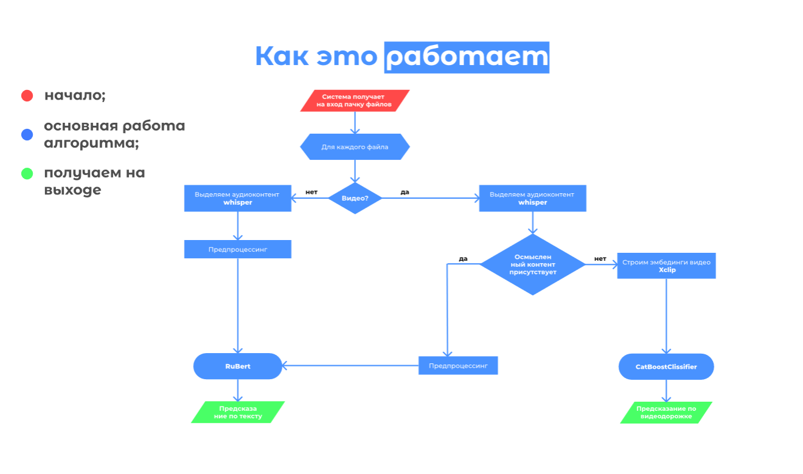

# Цифровой Прорыв 2024 (УрФО)

*ГНУ МИСИС team*

Team Members:
1) **Груздев Александр** - ML Engineer
2) **Рыжичкин Кирилл** - ML Engineer, Backend
3) **Миронов Егор** - Frontend, Backend
4) **Москвин Владимир** - Product Manager & Designer

Презентация: [link](https://drive.google.com/)

Frontend: https://gnu-misis.streamlit.app/

API: http://gnu.itatmisis.ru:8000/docs#/

## Задача трека "Креативный фильтр"

На основе имеющихся данных и разметки необходимо разработать модель, которая предсказывает то, к какому сегменту (*Segment_num*) относится заданный креатив (*Advertisement ID*). При разработке решения не забывайте про отраслевые критерии.

## Данные:

1. Папка **data** - различные рекламные креативы следующих форматов: .wav, .mp4, .avi, .flv, .wbm, .ogg. Каждый файл носит название, соответствующее Advertisement ID - уникальный идентификатор рекламного креатива.
2. Файл **train_segments.csv** - сопоставления идентификаторам номеров сегментов.
3. Файл **segment_dict.xlsx** - словарь, отображающий номер сегмента в его название.
4. Файл **dashboard_data.csv** - информация по затратам на различные креативы по месяцам для использования при визуализации дашбордов. На один месяц может приходиться более одной строки с уникальным идентификатором - в таком случае затраты необходимо просуммировать.

## Требования к разрабатываемой модели:
- Высокая точность сегментации
- Масштабируемость решения
- Адаптивность решения под меняющиеся реалии рынка
- Высокая скорость работы

## Предложенное решение

Транскрибируем информацию из аудиофайла или звуковой дорожки видеоролика с помощью *whisper-small* и проводим классификацию, используя извлеченную информацию. Для классификации текстовой составляющей звуковой дорожки используем *rubert-tiny*. Если же текста обнаружено не было, то переходим к классификации по видео: генерируем фичи с помощью *x-clip* и подаем их на вход *catboost*, также есть вариант с "cosine similarity"

## Метрики:

**BERT**:
- precision: 0.75
- recall: 0.73
- f1score_macro: 0.72

**XCLIP + COSINE SIMILARITY**: 
- f1score_macro: 0.42 (xclip features + cosine similarity)

**XCLIP + CATBOOST**: 
- f1score_macro: 0.41 (xclip features + catboost)

Итоговое время инференса ~2мс.

## Сервис

Бэкэнд написан на FastAPI, фронтент на Streamlit, все решение развернуто на VK Cloud Remote Machine.

Методы API:

- */predict*: принимает видео или аудио на вход - возвращает класс
- */predict_table*: принимает xlsx таблицу с advertisment id - возвращает аналогичную таблицу с предсказанными классами для каждого id

Дэшборды:
